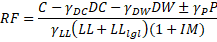

Computing Emergency Vehicle and Permit Rating Factors {#computing_permit_rating_factors}
======================================

Section 13.1.1 of the WSDOT BDM provides a modified procedure for computing rating factors for Emergency and Permit Vehicle ratings. Rating factors are computed as

The governing combination of legal and emergency/permit live load is the one that minimizes RF. The myriad of lane positions and locations of the emergency/permit vehicle within the arrangement of lanes makes it difficult to efficiently compute the minimum rating factor.

XBRate uses a simplified approach to reduce the number of combinations of loaded lanes and emergency/permit vehicle locations that must be evaluated to determine the rating factor.

The cross beam is evaluated for one or more loaded lanes, with vehicles of the same weight in each lane during the design and legal load rating analysis. During this analysis, the load cases that produce the 10 greatest positive moment, negative moment, and shear at each rating location is recorded.

The emergency/permit case is evaluated with this subset of load cases, substituting the emergency/permit vehicle into each loaded lane and the maximum legal load vehicle into the remaining lanes. 

Example:

Live Load Combination 345 produces one of the 10 greatest moments at a section in the cross beam. This load combination consists of 3 loaded lanes. For the permit
evaluation we'll use the following live load arrangements:

* LC345,P1 = Live Load Combination 345 with Permit Vehicle in Lane 1 and Legal Load Vehicles in the remaining lanes
* LC345,P2 = Live Load Combination 345 with Permit Vehicle in Lane 2 and Legal Load Vehicles in the remaining lanes
* LC345,P3 = Live Load Combination 345 with Permit Vehicle in Lane 3 and Legal Load Vehicles in the remaining lanes

The rating factor is computed for each of these live load arrangements.

This is repeated for the 9 other candidate cases. The live load combination and vehicle arrangement that produces the smallest rating factor governs.

The governing live load combination and vehicle arrangement is also used to compute the [reinforcement yield stress ratio](@ref computing_the_reinforcement_yield_stress_ratio).