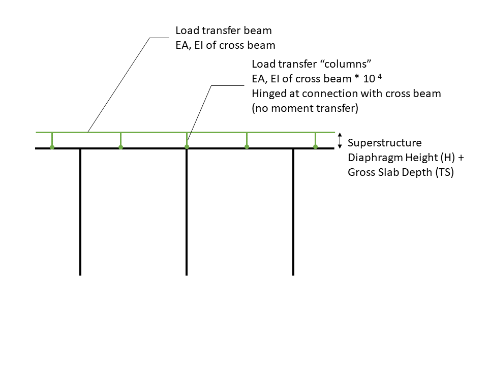

Live Load Transfer Model {#liveload_transfer_model}
==============================================
Live load reactions can be applied directly to the cross beam or applied through the bearing locations with the use of a live load transfer model.

The live load transfer model is illustrated below as the green frame on top of the bent model. The vertical "columns" represent the girders through which the live load reactions are transfered to the bearings. These members are hinged at the bottom so there isn't moment transfer. These members are also very flexible so the load transfer frame doesn't attract dead load forces from the real cross beam. The horizontal members have the same stiffness as the cross beam and are continuous across and integral with the vertical members.

