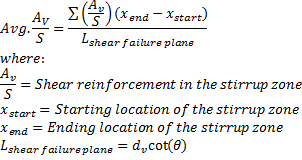

Shear Capacity {#shear_capacity}
==============================================

Shear capacity is computed using the Simplified Procedure for Nonprestressed Sections in accordance with LRFD 5.8.3.4.1. The capacity due to shear reinforcement is estabilished using the average shear reinforcement area per unit length (Av/S) within the shear failure plane at a section. The average Av/S is computed using Equation 1 which is based on LRFR Eq. 6A.5.8-1.

> NOTE: The length of the shear failure plane near the ends of the cross beam is reduced so that it does not extend beyond the end of the cross beam.

