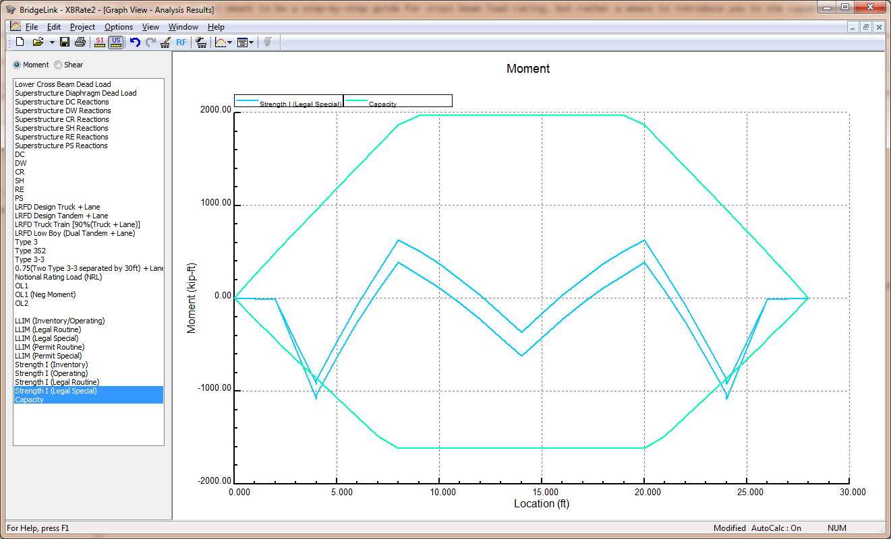
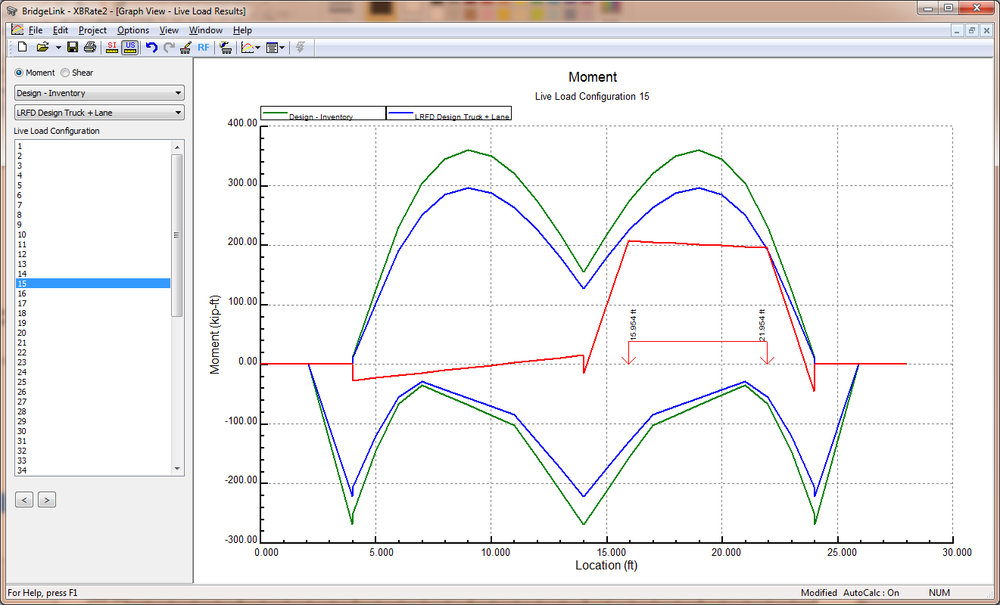

Review Analysis Results {#analysis_results}
======================================
All of the load rating analysis results are available in the Load Rating report. In addition to the governing rating factors, the Load Rating report provides the details of how the rating factors where computed, what loadings where used, how moment and shear capacities where computed and more. There is sufficient detail in the Load Rating report to verify any result.

Graphical representations of the analysis results are also available in the Analysis Results graph. Select View > Graphs > Analysis Results.

 

Use the options at the top of the window to select Moment or Shear results. Select the loading conditions to graph. 

Live load results are also available graphically with the Live Loads Results graph. Select *View > Graphs > Live Load Results*.

 

Again, using the options at the top of the window, select Moment or Shear results.

With the drop down lists, select the load rating type and the rating vehicle.

Select a live load configuration from the list. This will show the response in the cross beam due to a specific live load case. Move the live load left and right with the [<] and [>] buttons.
