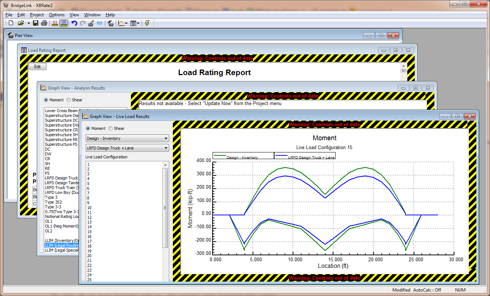

Toggle AutoCalc Mode {#autocalc_mode}
======================================
You probably noticed that XBRate updates graphs and reports on its own. You never had to find a command to tell the program to do the load rating analysis. This is AutoCalc (automatic calcuation) mode. You simply create graphs and reports and the software knows what to do. When your model changes, the graphs and reports automatically update.

For some large models, AutoCalc mode can be a bit cumbersome. The lag time between editing your pier and update results may be too long. If this is the case for you, AutoCalc model can be disabled.

## Disabling AutoCalc Mode
Select *Options > Turn AutoCalc Off*. This will turn off the AutoCalc mode. If you look at the status bar you will see the status of the AutoCalc mode.

Repeat this step to turn AutoCalc back on.

> TIP: To toggle the AutoCalc mode on and off, you can double click on the AutoCalc field in the status bar.

# Outdated Results
Now that the AutoCalc mode has been turned off, the graphs and reports will not automatically update. It is important to keep the you informed about the status of the information being viewed. Out of date analysis results are framed with a warning indicating the information presented does not reflect the current pier model.

# Recognizing Out of Date Information

1. Before we can see the warning label, we need to edit the pier model. Select *Edit > Pier*
2. Select the Permanent Loads page
3. Change the DC loads to 400 kips
4. Press [OK].

Notice the warning labels that frame the graphs and reports.

 

The warning frame makes is very clear that the analysis results being displayed did not come from the current set of input parameters.

## Updating Analysis Results

After you are done making all your modifications to the pier model, you will want to update the graphs and reports.

1. Select *Project > Update Now*. XBRate will start doing whatever work is necessary to get the graphs and reports up to date.

> TIP: You can press the F5 key to update results.

> TIP: If you turn AutoCalc mode on, the results will automatically update.