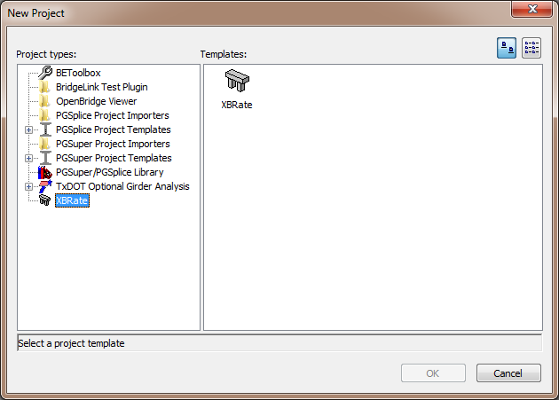
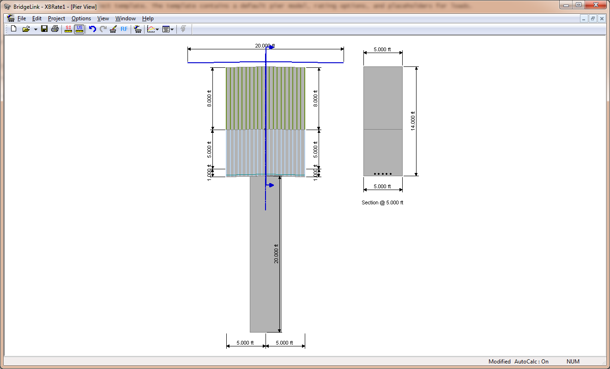

Create a Project {#create_project}
======================================
XBRate projects are created from the standard project template. The template contains a default pier model, rating options, and placeholders for loads.

## Start BridgeLink

The first thing we have to do is start the BridgeLink application.
1. Select *Start > Programs > Engineering Applications > BridgeLink* and click on the BridgeLink icon.

## Create a new project
To create an XBRate project:
1. Select *File > New*. This brings up the New Project window. 
2. Select the XBRate project type and the XBRate project template. Press the [OK] button.

After the project is created, you are presented with the Pier View. You can see the default pier geometry isn't what we need.

