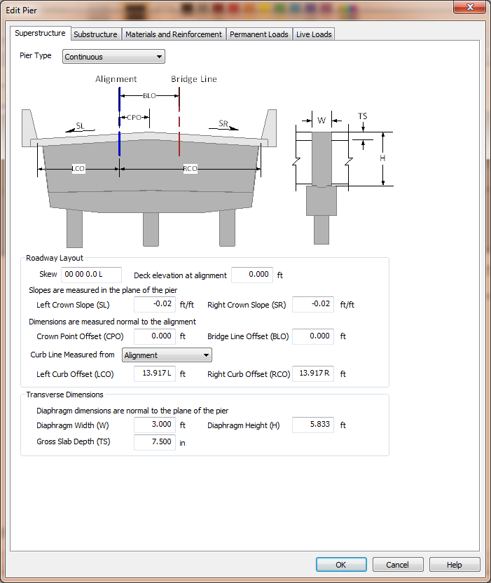
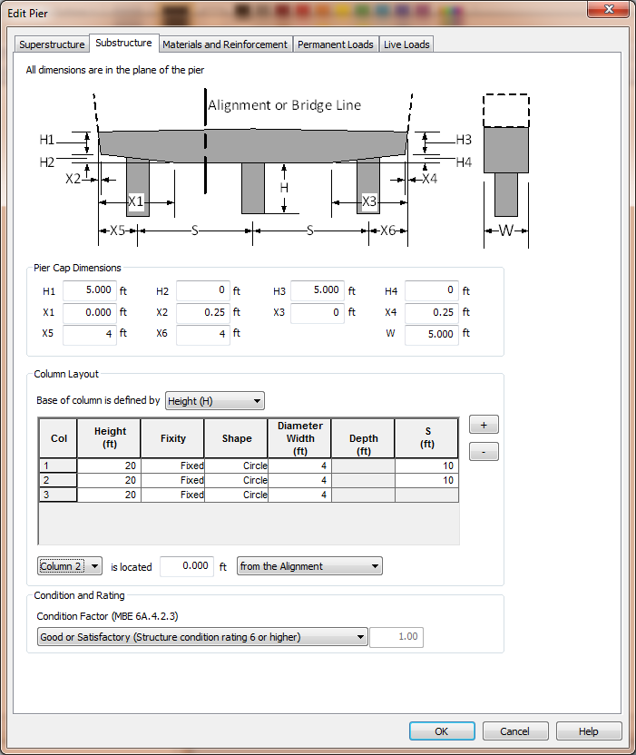

Edit the Pier Model {#editing}
======================================
The default pier model isn't exactly what we need. The geometry, materials, reinforcement, and loading don't represent our pier. The pier model will have to be edited.

Select *Edit > Pier* to edit the pier model. This brings up the Edit Pier window.

> Note: The Edit Pier window discussed here is for a stand-alone analysis. The pier model information is presented slightly differently for a PGSuper/PGSplice integrated analysis.

The Edit Pier window has 5 pages that group together related information about the pier.

Edit Pier Window Page | Description
----------------------|----------------------------
Superstructure | Used to define information about the bridge superstructure including connectivity, location, and geometry
Substructure | Used to define information about the substructure including the cross beam dimensions and column arrangement
Material and Reinforcement | Used to define the material properties and reinforcement
Permanent Loads | Used to define the load factors and superstructure reactions for permanent loads
Live Load | Used to define the live load factors and reactions.

## Superstructure
Basic superstructure information is defined on the Superstructure page. The superstructure is the portion of the pier that is above the top of the lower cross beam.

## Pier Type
XBRate supports three pier types; Continuous, Integral, and Expansion.

Pier Type | Description
----------|-------------------
Continuous | Used when the superstructure is continuous across the pier, but does not have a moment connection with the substructure. This is basically a hinged connection at the top of the cross beam.
Integral | Used when the superstructure is integral at the pier. There is a full moment connection with the superstructure and the substructure.
Expansion | Used when the superstructure does not have a moment connection across the pier or with the substructure.

## Curb Line Measure
The curb line measure defines the datum from which the curb line offset dimensions are measured. The curb lines can be located as offsets from the Alignment or the Bridge Line.

> NOTE: The Bridge Line is an arbitrary line that is parallel to and offset from the alignment. It provides a convenient basis for measurement.

## Roadway Layout
The dimensions in the Roadway Layout group define the orientation and dimensions of the roadway. 

> NOTE: Pay attention to how dimensions are measured. Crown slopes are measured in the plane of the pier and the offset dimensions are measured normal to the alignment.

## Transverse Dimensions
The transverse dimensions describe the height and width of the superstructure portion of the pier. For the continuous pier we are modeling, the dimensions are for the size of the hinge diaphragm.

> NOTE: The transverse dimensions are measured normal to the plane of the pier.

## Modeling our Pier
1. Enter the dimensions shown above to define the superstructure portion of our pier model.
2. Click on the Substructure page to continue defining our pier model.

> NOTE: When integrated with PGSuper or PGSplice, the superstructure dimensions are taken directly from the bridge model geometry.

## Substructure
The dimensions of the substructure portion of the pier are defined on the Substructure page. 

> NOTE: all dimensions on the Substructure page are defined in the plane of the pier.

## Pier Cap Dimensions
The pier cap dimensions describe the cap beam (also called the cross beam). 

## Column Layout
The column layout dimensions describe the type, size, and location of the columns. The base of a column can be defined by either its height (measured from the bottom of the cap beam) or by its bottom elevation.

> NOTE: When the base of a column is described by its bottom elevation its height is computed using the Deck Elevation at Alignment, crown slopes, and superstructure and substructure dimensions. Refer to the [Technical Guide](@ref technical_guide) for details.

The individual columns are defined in the column grid. Use the [+] and [-] buttons to add and remove columns from the grid.

Input the column height, or base elevation, assumed fixity in the plane of the pier, the column shape and dimensions, and the spacing to the next column.

The columns are located transversely by specifying a column and its offset from either the Alignment or the Bridge Line.

## Condition and Rating

Enter the condition factor for the cross beam.

## Modeling our Pier
1. Enter the dimensions shown above to define the substructure portion of our pier model.
2. Click on the Materials and Reinforcement page to continue defining our pier model.