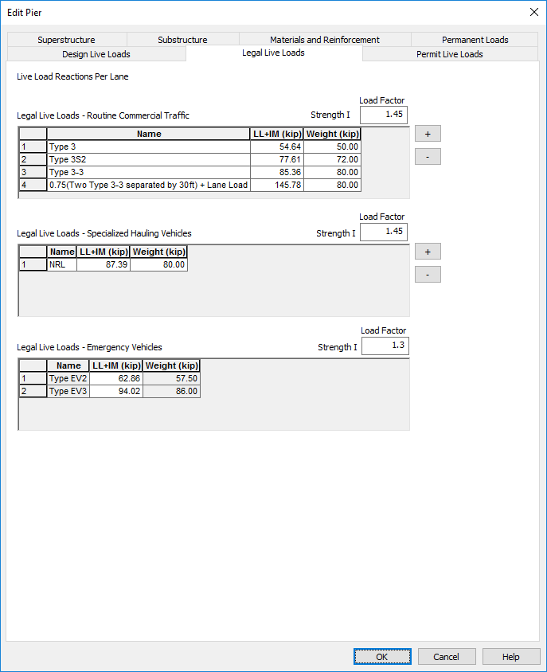
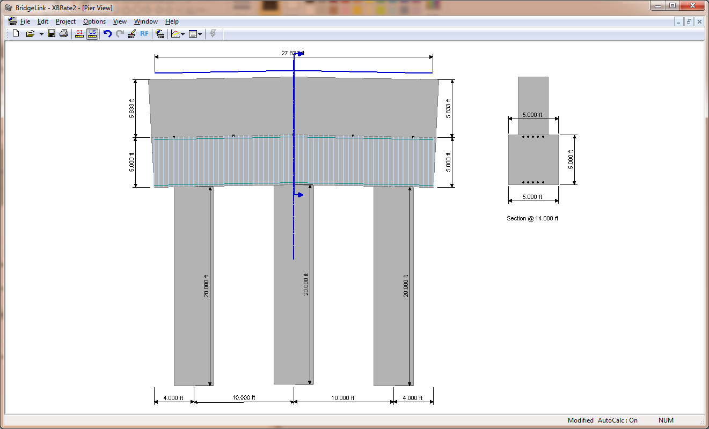

Define Live Loads {#live_loads}
======================================
Once again, because our pier is defined independently from the bridge, we have to supply the live load reactions from the superstructure. Live load reactions and load factors are defined on the Live Loads page.

 

## Live Load Reactions
Live load reactions are always input as the reaction for a single lane of live load. They should never be scaled by a live load distribution factor or a multiple presence factor.

Live load reactions can be modeled in the pier analysis by applying them directly to the cross beam or through the bearing locations. Typically, live load reactions are applied directly to the cross beam for Continuous and Integral piers and through the bearings for Expansion piers.

Use the [+] and [-] buttons to add and remove live loads reactions from the grids. For each live load reaction, enter a descriptive name of the loading and the magnitude of the reaction.

There are five live load grids, one for each load rating type.

Associated with each grid is the live load factor for the applicable limit states.

## Modeling our Pier

1.Enter the live loads and load factors shown above.
2. Press the [OK] button to complete the pier model definition.

The Pier View will be updated to show our model, as seen below.

 