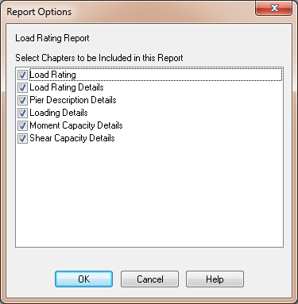

Create a Load Rating Report {#load_rating_report}
======================================
XBRate has only one report, the Load Rating Report. 

1. Select *View > Reports > Load Rating Report* to create the report.
2. Select the chapters to include in the report and press [OK] 
3. The report will be automatically created.

> NOTE: If AutoCalc mode is turned off, select *Project > Update Now* to cause the report to be created. We'll learn more about AutoCalc mode later in this tutorial.