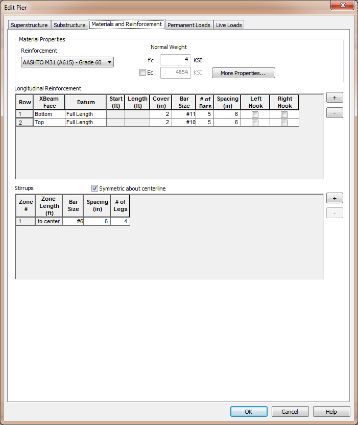

Define Materials and Reinforcement {#materials}
======================================
The next step in defining our pier model is to define the materials and reinforcement. There isn't much to this step because the cross beam consists of only steel reinforcing bars and concrete.
 

## Material Properties
Reinforcement: Select the type of reinforcement from the list of available choices.

Concrete is defined by its strength (f'c) and modulus of elasticity (Ec). Additional properties can be defined by pressing the [More Properties...] button.

## Longitudinal Reinforcement
The longitudinal reinforcement is defined in this grid. Using the [+] and [-] buttons to add and remove entries. Longitudinal reinforcement is defined by a relative face of the cross beam, bar dimensions, cover, size, spacing, and detailing.

Longitudinal reinforcement is defined as horizontal rows of bars.

Bar rows are located vertically from the Top or Bottom Face of the cross beam for Continuous and Expansion Piers, and from the Top, Top of Lower XBeam, and Bottom Face for Integral Piers.

Bar rows are located horizontally from the left or right face of the cross beam and have a specified starting location and length, or they can be defined as Full Length meaning they run the full length of the cross beam. Use the options in the Datum column to define how bars dimensions are defined.

A bar row is defined by the Bar Size, Number of Bars in the Row and the Bar Spacing.

> NOTE: The bar spacing isn't a critical parameter. It is only used for graphical representations of bar rows.

Bars can be designated as hooked at the Left or Right end. The analysis will assume hooked bars are fully developed over their full length, otherwise the effective area of the bar will be reduced over the development length.

## Modeling our Pier

1. Enter the material properties and reinforcement show above
2. Click on the Permanent Loads page to continue defining our pier model.

