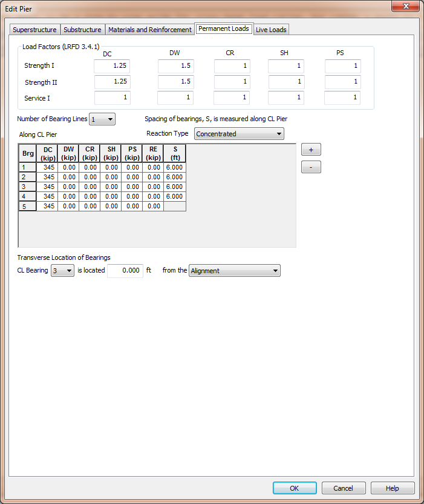

Define Permanent Loads {#permanent_loads}
======================================
Because our pier is defined independently from the bridge, we have to supply the permanent load reactions from the superstructure. Permanent load reactions and permanentload factors are defined on the Permanent Loads page.

## Load Factors
The permanent load factors for the applicable LRFD limit states are entered in the Load Factors group. Enter load factors for the DC, DW, CR, SH, and PS load cases as applicable.

## Bearings and Reactions
The superstructure reactions are applied to the pier model through the bearing locations. There can be one or two bearing lines at a pier. One bearing line is typically used for Continuous and Integral piers while two bearing lines are typically used for Expansion piers. 

The superstructure reaction can be applied as a concentrated load at the bearing locations or as a uniform load, spread over a specified width, centered on each bearing location.

Use the [+] and [-] buttons to add and remove bearing locations from the grid.

For each bearing entry in the grid enter the DC, DW, CR, SH, RE, and PS reactions. Also enter the spacing (S) between each bearing location. For some girder types, such as precast slabs, the reactions are spread over a width, W.

The location of the bearings with respect to the overall pier geometry is defined by entering the Centerline (CL) Bearing of a specific bearing as an offset from either the Alignment or Bridge Line.

The permanent load consist of all the loads in the DC and DW load cases as well as any secondary effects from the CR, SH, RE, and PS load cases. The self weight of the cross beam and the upper diaphragm are automatically computed by XBRate and should not be included in the DC load.

## Modeling our Pier
1. Enter the load factors, bearing geometry and reactions shown above.
2. Click on the Live Loads page to complete our pier model.