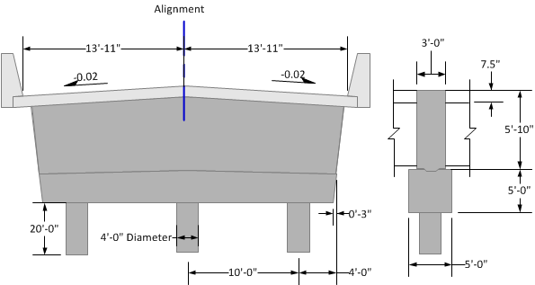

General Features {#general_features}
======================================
This tutorial highlights the major features of XBRate. It is not meant to be a step-by-step guide for cross beam load rating, but rather a means to introduce you to the capabilities of the software.

XBRate performs load rating analysis for reinforced concrete cross beams in accordance with the AASHTO Manual for Bridge Evaluation and the WSDOT Bridge Design Manual. XBRate can perform a stand alone load rating or an integrated load rating. A stand alone load rating occurs when a pier and cross beam are modeled independent from the bridge. An integrated load rating occurs when XBRate is used as an extension to PGSuper or PGSplice and the pier model and loadings are taken directly from the bridge model.

This tutorial will focus on the general features of XBRate. In general, the information is presented here is applicable to both stand alone and integrated modes. We will be working with a stand alone load rating model in this tutorial. The difference between stand alone and integrated modes will be noted. The Cross Beam Load Rating from PGSuper/PGSplice tutorial will focus on the integrated load ratings capabilities of XBRate..

In this tutorial you will:
1. @subpage create_project
2. @subpage editing
3. @subpage materials
4. @subpage permanent_loads
5. @subpage live_loads
6. @subpage load_rating_report
7. @subpage analysis_results
8. @subpage autocalc_mode

## Pier Information
A schematic of the pier model is shown below. The superstructure is continuous over the pier, but does not have a moment connection with the substructure. The superstructure has 5 girder lines that are centered on the alignment and spaced at 6'-0". The DC reaction at each girder line is 345 kips. The cross beam is reinforced with 5 #11 bars along the bottom face and 5 #10 bars along the top face. Double #6 stirrups at 6" spacing are used for shear reinforcement.

 