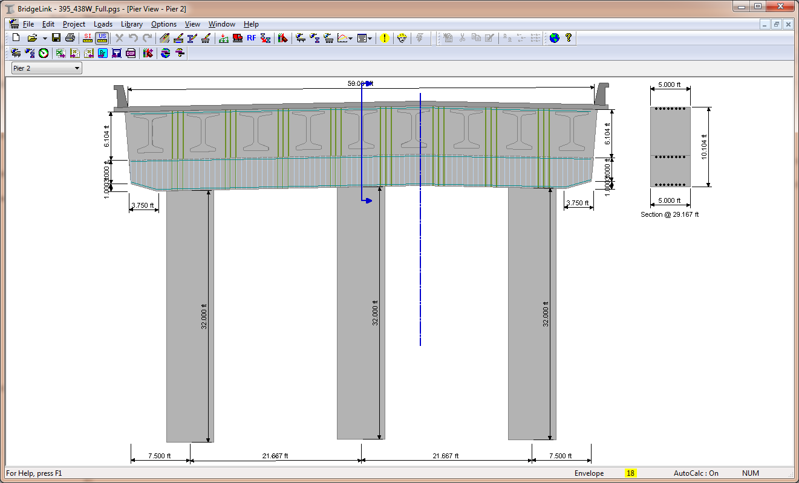

Create a Pier Model {#create_pier}
======================================
Because piers are an integral part of PGSuper/PGSplice we don't have to look to far to find the pier model. The basic steps for defining the pier model in PGSuper/PGSplice are:

1. Create a new PGSuper project.
2. Edit the bridge model so that it has at least two spans
3. Select *Edit > Abutment/Pier*. When prompted, select Pier 2. The Pier Details window will open.
4. Select the Layout tab
5. Set the Pier Model Type to Physical.
6. Enter the cap beam and column layout dimensions as well as the concrete material properties.
7. Select the Connections tab
8. Use the Boundary Condition option to select the super-to-substruture connectivity.
9. Enter the dimensions of the pier diaphragm or use the keyword "Compute" to have the dimensions computed based on the girder connection properties

> NOTE: Pier can be modeled as Physical or Idealized. Idealized pier do not have any dimensions, the represent simple support conditions only. Only the cross beams of Physical piers can be load rated

XBRate extends the user interface of PGSuper/PGSplice by adding the XBeam tab to the Pier Details window.

1. Select the XBeam tab
2. Enter the reinforcement type, condition factor, and enter the longitudinal reinforcement and stirrups.
3. Press [OK].

You probably noticed that the pier definition and XBeam input are very similar to XBRate in stand alone mode.

Select *View > Pier View* to view the pier model.

> TIP: The Pier View can only display piers that have been modeled as "physical" piers.

