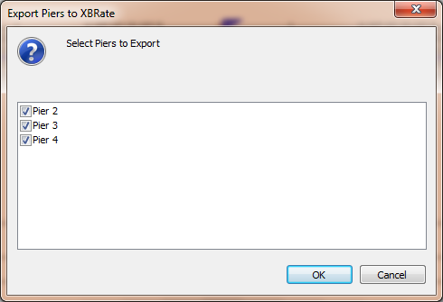

Export Pier Models {#pgs_export_pier_models}
======================================
The XBRate pier models can be exported from PGSuper/PGSplice to stand alone models. This decouples the pier model from PGSuper/PGSplice making it smaller and faster, however changes in the PGSuper/PGSplice pier model will not be reflected in the exported model.

Individual pier models can be exported as well as a batch of pier models.

## Exporting an Individual Pier Model

To export a pier model:
1. Right click a graphical object that represents a pier in the plan view PGSuper/PGSplice Bridge View
2. Select *Export to XBRate*
3. Enter the name of the XBRate project file
4. Press the [Save] button
5. When the export process is complete you'll be asked if you would like to open the XBRate file. Press Yes to close PGSuper/PGSplice and open the XBRate file you just created, or press No to continue using PGSuper/PGSplice.

Alternatively, you can right click anywhere in the Pier View and select *Export to XBRate*.

> NOTE: The default XBRate project file name is the name of your PGSuper/PGSplice file with the pier name appended to it.

## Exporting Several Pier Models
To export several models at once
1. Select *File > Export > Piers to XBRate*
2. Select one or more piers to be exported 
3. Press [OK]
4. For each pier in the list, you will be prompted for an XBRate project file name. Enter a file name, or use the default, and press [Save]
5. You will be notified when the export process is complete. Press [OK]

