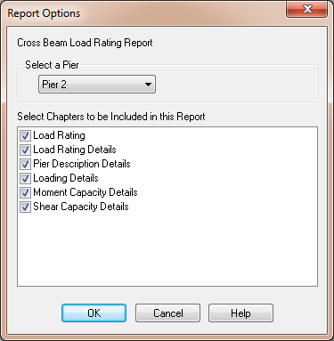

Create a Load Rating Report {#pgs_load_rating_report}
======================================
The load rating reports are created are just like any other report in PGSuper/PGSplice. To create the cross beam load rating report:

1. Select *View > Reports > Cross Beam Load Rating Report*
2. Select the subject pier in the Report Options window 
3. Press [OK]

