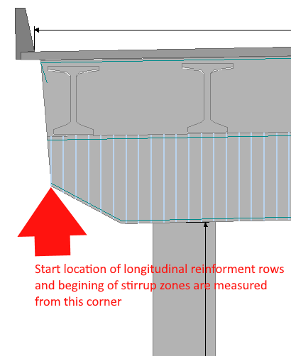

PGSuper/PGSplice Materials {#appendix_a_pgs_materials}
============
XBRate adds a tab titled XBeam to the Pier Details window in PGSuper and PGSplice. The materials of the cross beam not defined on the Pier Details window Layout tab are defined on this tab.

## Material Properties
 Item | Description
----|------
Reinforcement | Use the drop down list to select the reinforcement material used in the cross beam

> NOTE: Concrete properties are defined on the Layout tab

## Condition Factor

Item | Description
-----|------------
Condition State List | Use the drop down list to select a condition state of the cross beam.
Condition Factor | The conditation factor associated with the selected condition state is show here. If the condition state is Other, enter the condition factor

Reinforcement Coordinates
-------------

## Longitudinal Reinforcement
Define the longitudinal reinforcement in the cross beam. Reinforcement is defined as horizontal rows of reinforcement.

Item | Description
-----|------------
Row  | Identifies a row of reinforcing.
XBeam Face | Using the drop down list, select the face of the cross beam from which the reniforcement is located. 
Datum | Use the drop down list to select the datum for locating the reinforcement along the length of the cross beam. Use Full Length if the reinforcement runs the full length of the cross beam. The reinforcement can also be defined as starting some distance from the left or right end of the cross beam.
Start | Location of the start of the reinforcement measured from the specified datum
Length | Length of the reinforcing bars
Cover | Clear cover from the specifed XBeam face to the edge of the reinforcement
Bar Size | Select a bar size from the drop down list
# of Bars | Enter the number of bars in the horizontal row
Spacing | Enter the horizontal spacing of the bars
Left Hook | When checked, the left end of the bar is hooked and is assumed to be fully developed
Right Hook | When checked, the right end of the bar is hooked and is assumed to be fully developed

> NOTE: The top of the cross beam is considered to be at the bottom of the main slab

## Lower Cross Beam Stirrups
Deine the stirrups in the lower cross beam. Stirrups are defined left to right along the length of the cross beam

Item | Description
-----|----------
Symmetric about centerline | When checked, the stirrups are defined along the left half of the cross beam and reflected onto the right half. Otherwise the stirrups are defined over the full length of the cross beam. The length of the last zone of stirrups is adjusted to fit the lenght of the cross beam.
Zone # | Indicates a zone of stirrups
Zone Length | Length of the stirrup zone. This item has a value of "to center" for symmetric stirrups or "to end" for the last zone.
Bar Size | Select a bar size from the drop down list
Spacing | Enter the spacing of the stirrups
# of Legs | Enter the number of stirrup legs

## Full Depth Stirrups
Deine the stirrups in the full depth cross beam. Stirrups are defined left to right along the length of the cross beam

Item | Description
-----|----------
Symmetric about centerline | When checked, the stirrups are defined along the left half of the cross beam and reflected onto the right half. Otherwise the stirrups are defined over the full length of the cross beam. The length of the last zone of stirrups is adjusted to fit the lenght of the cross beam.
Zone # | Indicates a zone of stirrups
Zone Length | Length of the stirrup zone. This item has a value of "to center" for symmetric stirrups or "to end" for the last zone.
Bar Size | Select a bar size from the drop down list
Spacing | Enter the spacing of the stirrups
# of Legs | Enter the number of stirrup legs
