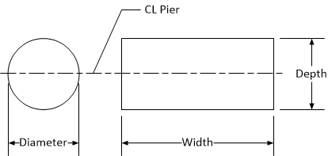

Substructure {#appendix_a_pier_substructure}
============
Geometric information about the substructure is defined on this tab.

> NOTE: All dimensiosn are in the plane of the pier

Pier Cap Dimensions
--------------------

Enter dimensions H1 - H4, X1 - X6, and W as defined in the schematic

Column Layout

Item | Description
-----|-----------------
Base of column is defined by | Select an option for how the base of the column is defined. The base of the column can be defined by entering a column height or bottom of column elevation.
Col | Index of the column
Height | Height of column when base is defined by column height
Bottom Elev | Bottom elevation of column when base is defined by bottom elevation
Fixity | Transverse base fixity of the columns
Shape | Select the column span,  Circle or Rectangle.
Diameter/Width | Diameter of a circular column or width of a rectangular column. Width is measured in the plane of the pier.
Depth | Depth of the column. Depth is measured normal to the plane of the pier.
S | Center to center column spacing
Transverse Location of Columns | Select a column to locate transversely with respect to the alignment or bridge line. Enter the offset of the column from the alignment or bridge line.

Condition and Rating
--------------------

Item | Description
-----|------------
Condition State List | Use the drop down list to select a condition state of the cross beam.
Condition Factor | The conditation factor associated with the selected condition state is show here. If the condition state is Other, enter the condition factor
