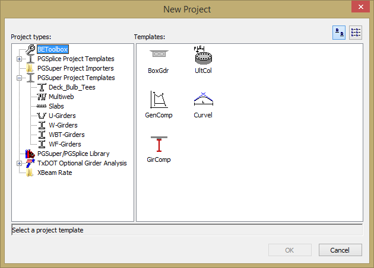
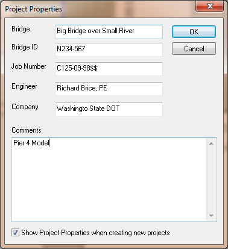

Chapter 2 - Projects {#chapter2}
==============================================

In this chapter you will learn how to create XBRate projects, how to open existing projects, how to save projects, and how to manage project properties.

You can equate an XBRate project to an input file. XBRate projects have and XBR extension.

## Creating a New Project
XBRate defines a default project. All projects start with the same information and are then edited to represent a specific pier and cross beam.
To create a new project
1. Start BridgeLink
2. Select *File > New* to open the New Project window
3. Select the XBRate project in the Project Types box
4. Select the XBRate template in the templates box
5. Press [OK] to create a new projects

## Opening an Existing Project
You can open existing XBRate projects using several different techniques.

> TIP: BridgeLink can only have one project open at a time. However, you can run multiple instances of BridgeLink, each with a different project open.

### Techniques for Opening XBRate Projects
#### Recent Project List
The most common method of opening a project is to select it from the Recent Projects List located on the File menu.
> TIP: Press the down arrow to left of the Open button on the toolbar to quickly access the Recent Project List

#### Open Command
The standard method of opening files in any Windows program is to use the *File > Open* command. This commands displays the standard File Open window. Using this window, find a project file to open. Use the file type filter to display only files of the type you want to open.

#### Drag and Drop
If you locate your project file using Windows Explorer or My Computer, you can drag and drop it onto a running instance of BridgeLink to open the project.

#### Associated Files
If you locate your project file using Windows Explorer or My Computer, you double click on it to start BridgeLink and open the project.

## Saving Projects
Save your projects using either the Save or Save As commands. The Save command allows you to quickly save your current project and keep working. The Save As command saves
the current project with a new name.

> TIP: Computers are very unforgiving tools, especially when the power goes out. Save frequently!

## Project Properties
XBRate has a simple accounting feature called Project Properties. You can record information such as Bridge Name, Job Number, your name and company, and any descriptive
comments.

To define your project properties:
1. Select *Project > Properties*
2. Enter the project information in the Project Properties window
3. Press [OK] to update the properties

If the box at the bottom of the Project Properties window is checked, you will be prompted for project properties each time you create a new XBRate project.
