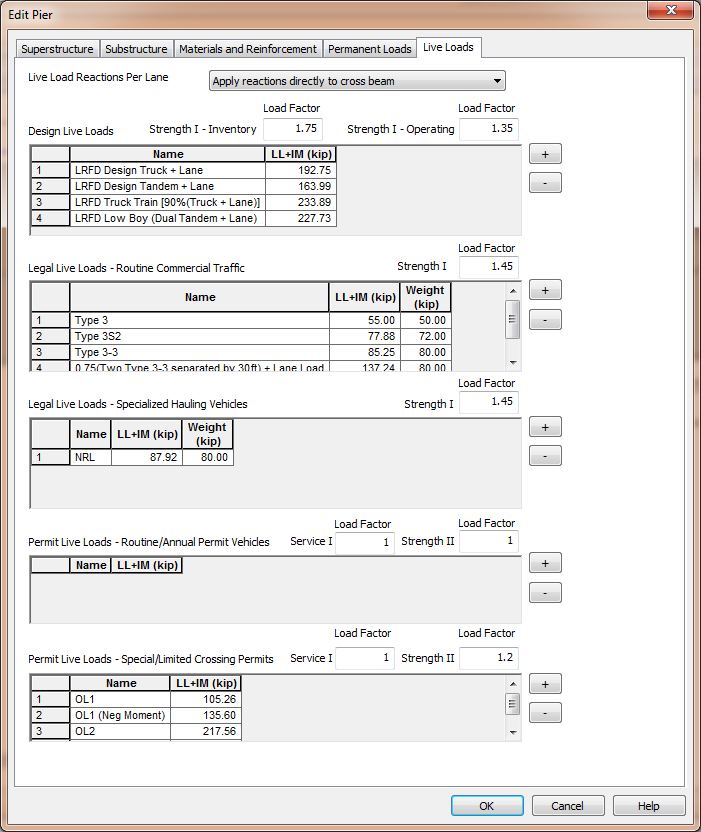

Live Loads {#chapter3_live_loads}
==============================================
## PGSuper/PGSplice Live Loads
The live loads are extracted from the girder line analysis performed by PGSuper/PGSplice. These loads are automatically applied to the XBRate pier model during the load rating analysis.

The live load factors are taken from the PGSuper/PGSplice Load Rating Options.

## XBRate Live Loads
Live load reactions must be explicitly input into XBRate. This is done on the Live Loads tab of the Edit Pier window.

> NOTE: Live Load Reactions are for a lane of live load. Do not multiple live load reactions with live load distribution factors, multiple presence factors, or load factors

> NOTE: When integrated with PGSuper/PGSplice, the live load reactions are those associated with the longest girder line.

## Live Load Application
Live load reactions can be applied directly to the cross beam or applied through the bearing locations.

When applied directly to the cross beam, the live loads are applied to the cross beam member of the analysis model as described in WSDOT BDM 3.9.4E.

In general, live load reactions are applied directly to the cross beam for Continuous and Integral piers and through the bearings for Expansion piers.

## Live Load Reactions
For each rating type, define the live load factor for the indicated limit states. In the live load grids, enter a name for the live load and a reaction. For the legal load ratings, also enter a vehicle weight that will be used in the load posting analysis.

