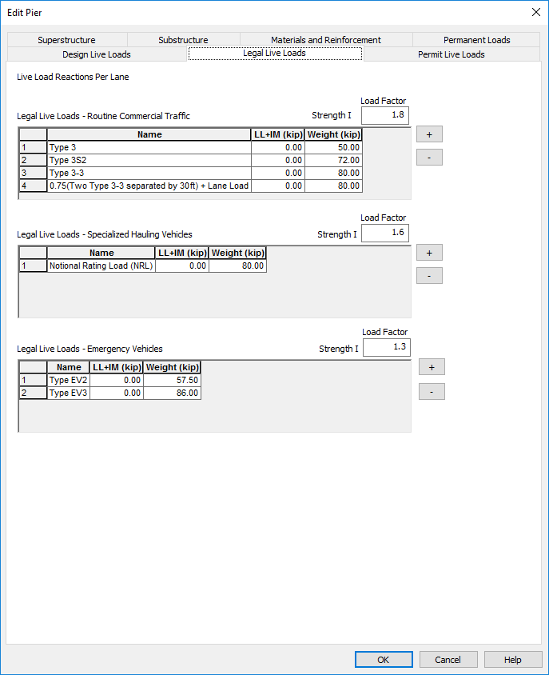

Live Loads {#chapter3_live_loads}
==============================================

## XBRate Live Loads
Live load reactions must be explicitly input into XBRate. This is done on the Design, Legal, and Permit Live Loads tabs of the Edit Pier window.

> NOTE: Live Load Reactions are for a lane of live load. Do not multiply live load reactions with live load distribution factors, multiple presence factors, or load factors

> NOTE: When integrated with PGSuper/PGSplice, the live load reactions are those associated with the longest girder line.

### Live Load Reactions
For each rating type, define the live load factor for the indicated limit states. In the live load grids, enter a name for the live load and a reaction. For the legal load ratings, also enter a vehicle weight that will be used in the load posting analysis.

## PGSuper/PGSplice Live Loads
The live loads are extracted from the girder line analysis performed by PGSuper/PGSplice. These loads are automatically applied to the XBRate pier model during the load rating analysis.

The live load factors are taken from the PGSuper/PGSplice Load Rating Options.
