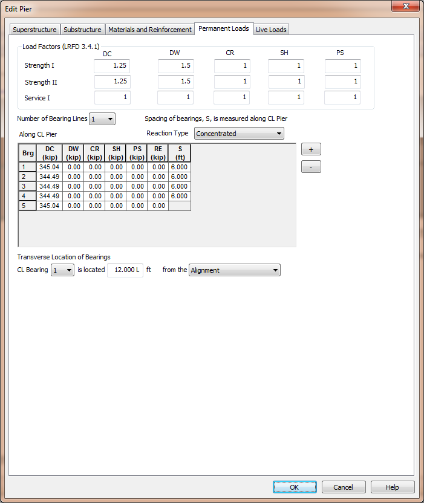

Permanent Loads {#chapter3_permanent_loads}
==============================================
Permanent loads are dead load reactions and secondary effects.

## XBRate Permanent Loads
Permanent load reactions must be explicitly input into XBRate. This is done on the Permanent Loads tab of the Edit Pier window.

### Load Factors
Enter the permanent load load factors for the various limit states used in the load rating analysis.

### Permanent Load Reactions and Bearing Locations
The bearing reaction grid defines both the reactions for the various load cases and the spacing between bearings. One or two bearing lines can be defined at a pier.Typically, a single bearing line is used for Continuous and Integral piers and two bearing lines are used for Expansion piers. However, you can model the bearing lines in whatever way best fits your pier.

Bearing reactions can be defined as a concentrated force or a uniform force. When defined as a uniform force, the reaction is spread over a width W.

The transverse location of the bearings is defined by locating one bearing with respect to the Alignment or Bridge Line.

> NOTE: When integrated with PGSuper/PGSplice, permanent load reactions are applied to the pier model as concentrated forces except for Box Beams, Slab Beams, Decked Slab Beams. The permanent load reactions are applied as uniform loads over with width of the bottom of the girder.

## PGSuper/PGSplice Permanent Loads
The permanent loads are extracted from the girder line analysis performed by PGSuper/PGSplice.These loads are automatically applied to the XBRate pier model during the load rating analysis.

The permanent load load factors are taken from the PGSuper/PGSplice Load Rating Options.
