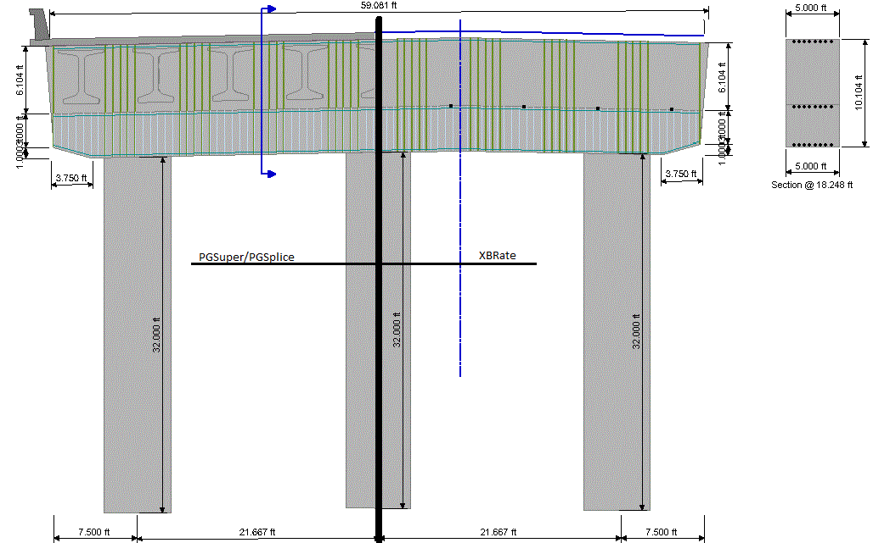

Understanding the Pier View {#chapter3_pier_view}
==============================================
The Pier View provides a graphical representation of the pier. The Pier View in PGSuper/PGSplicle is nearly identical to the Pier View in XBRate.

The Pier View can be access by selecting *View > Pier View*. When in PGSuper/PGSplice, right clicking on a pier in the Bridge Plan View and selecting Pier View from the context menu.

The contents of the Pier View is shown above. The Pier View from PGSuper/PGSplice is shown on the left and from XBRate on the right. The only difference is the superstructure (deck, girders, barriers) are shown on the left and the roadway surface, curb lines, and bearing locations (black dots on the cross beam) are shown on the right.

The dimension along the top of the view is the curb-to-curb width. This width is the basis for the number of rating lanes and the position of the lanes for rating analysis.

In XBRate, the blue line above the cross beam represents the roadway surface at the top of the slab.

The vertical, dashed blue line represents the Alignment.

The vertical, dashed brick-red line (not shown here) represents the Bridge Line.

The horizontal green-ish lines represent the longitudinal reinforcement.

The vertical blue-ish lines represent the lower cross beam stirrups.

The vertical olive lines represent the full depth stirrups.

The line weight of the stirrups represent the number of stirrups legs. The heavier the line, the more stirrup legs at a section.

The lower cross beam stirrups are drawn on top of the full depth stirrups so they are not hidden. 

The blue section cut graphic can be grabbed with the mouse and slid left and right along the cross beam. The location of the section cut line defines the section cut shown to the right of the pier.

You can also double click on the section cut graphic and then select a specific section.

In PGSuper/PGSplice, the Pier View has a small control bar along the top border. This bar is used to select the pier that is being displayed in the view.