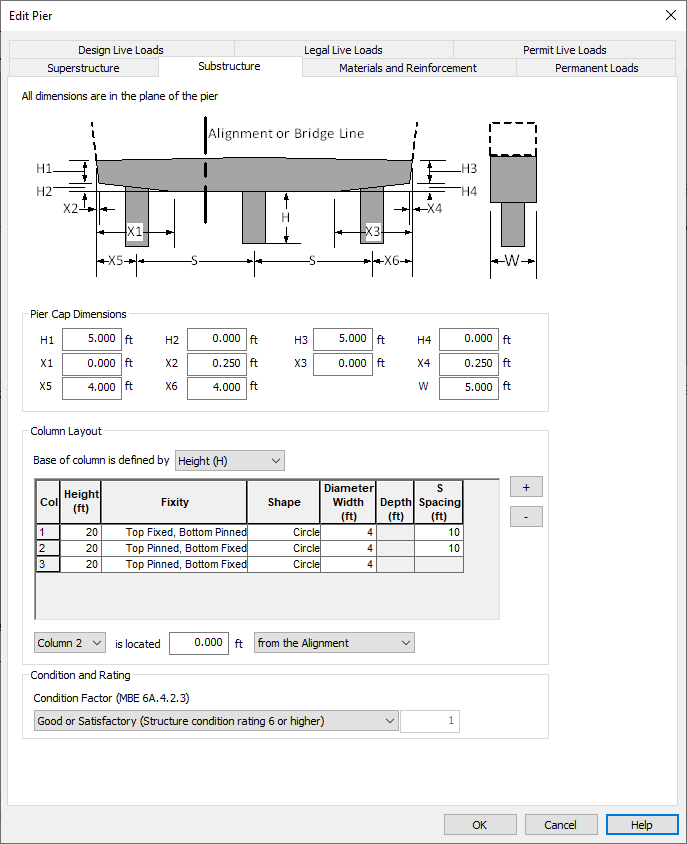

Substructure {#chapter3_substructure}
==============================================
The substructure consists of a cross beam and columns.

## XBRate Substructure Definition
When XBRate is being used as a stand alone application, the superstructure definition must be entered explicitly.

The substructure definition is nearly identical to the to that of a pier in PGSuper/PGSplice. The only difference is the Condition and Rating information.

### Condition and Rating
Enter the condition of the cross beam by selecting an option from the drop down list.

## PGSuper/PGSplice Superstructure Definition
The substructure definition is shared between PGSuper/PGSplice and XBRate. The substructure is defined on the Layout tab of the Pier Details window.

### Material Properties
The material properties defined here are for the column and cross beam concrete. The concrete is defined by its 28 day compressive strength (f'c). 

The modulus of elasticity (Ec) is computed using the AASHTO LRFD equations. If the Ec check box is checked, you can override the computed modulus of elasticity.

Press [More Properties...] to refine the concrete material properties.

### Cap Beam Dimensions
Enter the dimensions of your cap beam. The schematic on the Layout defines the various dimensional parameters. All horizontal dimensions, with the exception of W, are measured in the plane of the pier. W is measured normal to the plane of the pier.

### Column Layout
Use the [+] and [-] buttons to add and remove rows from the column grid. Each row in the grid represents a column. Enter the column size, shape, and fixity.

Using the options below the column grid, locate the columns transversely with respect to either the Alignment or Bridge Line.
