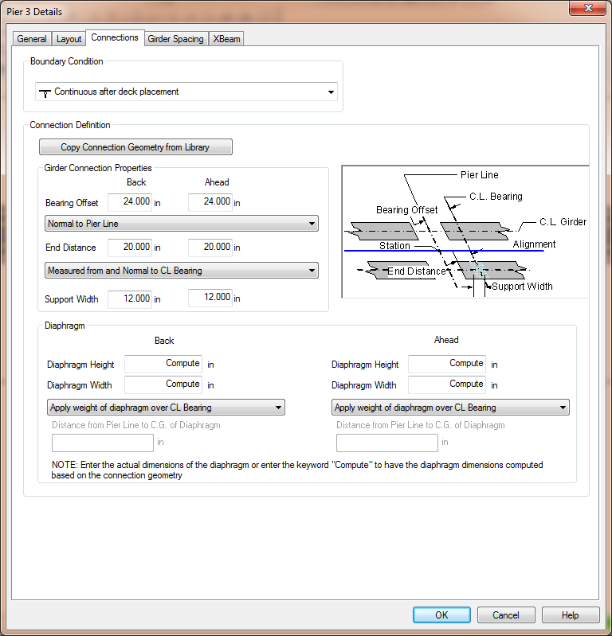
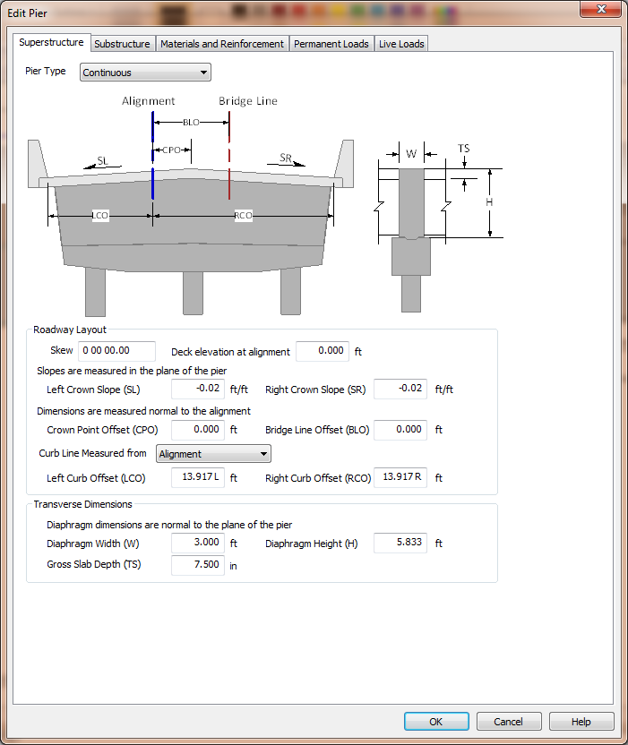

Superstructure {#chapter3_superstructure}
==============================================
The superstructure is considered to be everything above the top of the cross beam. This includes continuity hinge and integral diaphragms. The superstructure description
locations the pier with respect to the alignment, defines roadway surface geometry, and describes the superstructure diaphragm at the pier.

> NOTE: Even though the girder arrangement and bearing locations are part of the superstructure, the location of bearings and associated reactions are defined with the [Permanent Loads](@ref chapter3_permanent_loads).

## PGSuper/PGSplice Superstructure Definition
The superstructure definition is extracted from the bridge model with XBRate is integrated into PGSuper/PGSplice. The superstructure definition is derived from the information on the Connections tab of the Pier Details Window.

### Pier Type
The pier type is derived from the Boundary Condition as indicated below.

Boundary Condition | Pier Type
-------------------|----------
Hinge Roller | Expansion
Continuous Before Deck Placement Continuous After Deck Placement Continuous Closure Joint Continuous Segment | Continuous
Integral Before Deck Placement  Integral After Deck Placement Integral Before Deck Placement - Hinged Back/Ahead Integral After Deck Placement - Hinged Back/Ahead  Integral Closure Joint  Integral Segment | Integral

### Roadway Layout
The roadway layout is derived from the bridge and roadway geometry

### Superstructure Diaphragm
The dimensions of the superstructure diaphragm is taken from the Diaphragm properties.  The width of the diaphragm is take to be the sum of the back and ahead width. The
height of the diaphragm is taken to be the greater of the back and ahead heights.

If the keyword "Compute" is used for the diaphragm dimensions, the diaphragm dimensions are computed based on the Girder Connection Properties and the bridge geometry at
the pier.

The height of the diaphragm is the distance from the bottom of the deck to the bottom of the tallest girder at the pier. It is computed as the height of the tallest girder
at the pier + slab offset ("A" dimension) - gross slab thickness. 

The width of the diaphragm one each side of the pier is computed as:

Pier Type | Diaphragm Width
--------- |-----------------
Expansion | Support Width
Continuous | Bearing Offset - 0.5(Support Width)
Integral | Bearing Offset + 0.5(Support Width)

> NOTE: If the assumed pier dimensions don't accurately reflect your pier model, you can export the pier from PGSuper/PGSplice and edit the parameters directly in XBRate. See [Explorting Pier Models](@ref chapter3_exporting_models) for details.

## XBRate Superstructure Definition
When XBrate is being used as a stand alone application, the superstructure definition must be entered explicitly.

### Pier Type
XBRate supports three general pier types; Expansion, Continuous, and Integral. 

Pier Type | Description
----------|---------------
Expansion | The superstructure has an expansion joint at the pier. There is only a transfer of vertical reactions to the substructure.
Continuous | The superstructure has a moment connection across the pier, but there is no moment transfer to the pier.
Integral | The superstructure has a moment connection across the pier and with the pier itself. The superstructure diaphragm is assumed to be composite with the cross beam and contributes to the flexural and shear capacity of the cross beam.

### Roadway Layout
The roadway layout information describes geometric information about the roadway geometry at the pier and it locates the pier transversely.

> NOTE: Pay attention to how dimensions are measured. Crown slopes are measured in the plane of the pier and the offset dimensions are measured normal to the alignment.

The skew angle defines the angle the centerline pier makes with the normal to the alignment at the centerline of pier. The skew angle is used for adjusting dimensions
that are normal to the alignment to dimensions that are in the plane of the pier. 

The deck elevation at alignment locates the pier vertically. This elevation is the basis for computing the top and bottom of column elevations.

The left (SL) and right (SR) crown slopes define the slope of the roadway surface, in the plane of the pier. Slopes down and away from the crown point are negative.

The Crown Point Offset (CPO) locates the crown point with respect to the alignment.

The Bridge Line Offset (BLO) locates the Bridge Line with respect to the alignment. The Bridge Line is an arbitrary line that is parallel to, and offset from, the alignment
and can be used to describe the geometry of the pier.

The curb line measure defines how the curb line offsets are defined. The curb lines can be located from the Alignment or the Bridge Line.

The Left (LCO) and Right (RCO) Curb Offsets located the curb lines. The curb-to-curb width defines the number of lanes for load rating.

### Transverse Dimensions
The transverse dimensions are measured normal to the plane of the pier. They describe the width (W) and height (H) of the superstructure diaphragm and the gross thickness
of the deck slab (TS).

