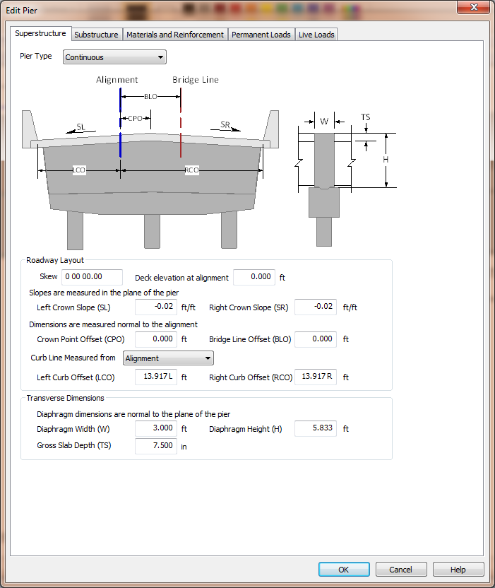
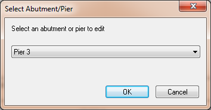
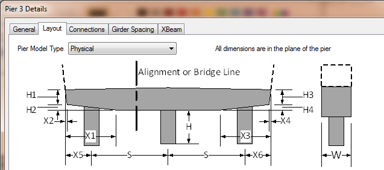

Chapter 3 - Pier Modeling {#chapter3}
==============================================
This chapter describes the pier modeling capabilities of XBRate. 

XBRate models the pier as a plane frame structure consisting of columns and a cross beam. XBRate supports three general types of piers: 

Pier Type | Description 
----------|-------------
Continuous | Used when the superstructure is continuous across the pier, but does not have a moment connection with the substructure. This is basically a hinged connection at the top of the cross beam.
Integral | Used when the superstructure is integral at the pier. There is a full moment connection with the superstructure and the substructure.
Expansion | Used when the superstructure does not have a moment connection across the pier or with the substructure.

The cross beam is at the interface between the substructure and superstructure of the bridge.  For our purposes, we will consider everything above the top of the cross
beam as superstructure, including continuous hinge and integral pier diaphragms.

## Pier modeled in XBRate
XBRate models a single pier, independent of the bridge.
To model a pier:
1. Select *Edit > Pier* to open the pier editing window
2. Enter the pier defintion on the various tabs
3. Press [OK]

## Pier modeled in PGSuper/PGSplice
Piers are modeled in PGSuper/PGSplice as either idealized supports or physical pier models. Idealized supports are customary fixed, pinned, and roller supports and define
the longitudinal boundary conditions for the bridge superstructure. Idealized supports lack sufficient detail to be used for cross beam load rating.

Physical pier models in PGSuper/PGSplice describe piers including the cross beam and columns. The physical pier model provides almost all the information needed to
load rating a cross beam. XBRate extends PGSuper/PGSplice by adding user interface elements to capture the addition information needed for cross beam load rating.

To model a physical pier in PGSuper/PGSplice:
1. Select *Edit > Abutment/Pier* 
2. Select a pier to edit from the dropdown list and press [OK]
3. Select the Layout Tab 
4. Set the Pier Model Type to Physical

## Other Topics
@subpage chapter3_superstructure

@subpage chapter3_substructure

@subpage chapter3_material

@subpage chapter3_permanent_loads

@subpage chapter3_live_loads

@subpage chapter3_pier_view

@subpage chapter3_exporting_models