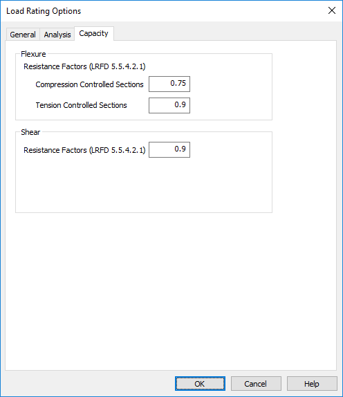
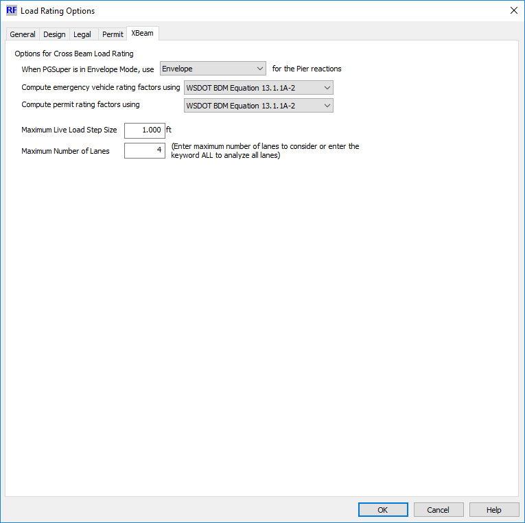

Chapter 4 - Load Rating Options {#chapter4}
==============================================
XBRate has several options for controlling the load rating analysis. 

## XBRate Load Rating Options
When in stand alone mode, all of the load rating options have to be specified. 

Select *Project > Load* Rating Options to edit the load rating options.

### General Options

 
#### Specifications
Select the AASHTO LRFD Bridge Design Specification and AASHTO Manual for Bridge Evaluation upon which to base the load rating analysis.

#### Design Rating
Use the check boxes to indicate if the Design Rating analysis is performed, and if so, if a load rating analysis for shear is to be performed.

#### Legal Load Rating
Use the check boxes to indicate if the Legal Load Rating analysis is performed, and if so, if a load rating analysis for shear is to be performed.

#### Permit Load Rating
Use the check boxes to indicate if the Permit Load Rating analysis is performed, and if so, if a load rating analysis for shear is to be performed. Additionally, indicate if the reinforcement is to be checked for yielding by MBE 6A.5.4.2.2b and indicate the method of analysis for determining the permit rating factors.

#### System Factor
Input the system factors.

### Analysis

### Live Load Step Size
XBRate determines live load moments and shears by placing many combinations of loaded lanes and lane positions on the cross beam. For each live load arrangement, the lanes are moved transverse across the pier based on a uniform step size. The Maximum Live Load Step Size parameter indicates the maximum uniform step that is to be used in the live load analysis. The smaller the step size, the more accurate the analysis, however the number or live load configurations can increase dramatically increasing analysis time. Larger steps sizes reduces the number of live load configurations and decreases analysis time, though it comes at the cost of less accurate analysis.

### Maximum Number of Lanes
The number of lanes to be analyzed is determined by AASHTO MBE 6A.2.3.2. Governing cases typically occur when fewer than the maximum number of lanes are loaded. This parameter sets the maximum number of lanes to be considered in the live load analysis. Using fewer lanes will increase the speed of the analysis. Enter the maximum number of lanes to be considered or the keyword "ALL" if all lanes are to be loaded.

### Capacity

Enter the resistance factor for flexure and shear

## PGSuper/PGSplice Load Rating Options
XBRate utilizes the load rating options for PGSuper/PGSplice and adds some additional options needed for cross beam load ratings.

XBRate adds an XBeam tab to the PGSuper/PGSplice Load Rating Options window. On this tab are load rating options that are specific to XBRate. The new load rating options provided by XBRate are described here.

 

### Pier Reactions
When the Structural Analysis Method in PGSuper is set to "Envelope of Simple Span and Simple made Continuous Analyses" there are two sets of reactions that can be used in the cross beam load rating analysis. Use the drop down list to select how reactions are to be taken from PGSuper and applied to the cross beam.

Option | Description
--------|----------
Simple | Use the reactions from a simple span analysis for cross beam load rating
Continuous | Use the reactions from a simple span made continuous analysis for cross beam load rating
Envelope | Use the greater of the simple span and simple span made continuous analyses for cross beam load rating

### Permit Rating Factor
WSDOT deviates from AASHTO when computing permit rating factors for cross beams. Use the drop down list to select how permit rating factors are computed.

Option | Description
-------|----------------
AASHTO MBE Equation 6A.4.2.1-1 | Permit load ratings are performed by the method described in the AASHTO MBE. A single lane containing the permit vehicle is analyzed recognizing that the load factors have been calibrated to represent legal loads elsewhere on the bridge.
WSDOT BDM Equation  13.1.1A-2 | Permit load rates are performed by the method described in the WSDOT BDM. A single permit vehicle is located in one lane and the governing legal load case is placed in the adjacent lanes on the structure.

Enter the maximum live load step size as described above.

Enter the maximum number of lanes as described above.
