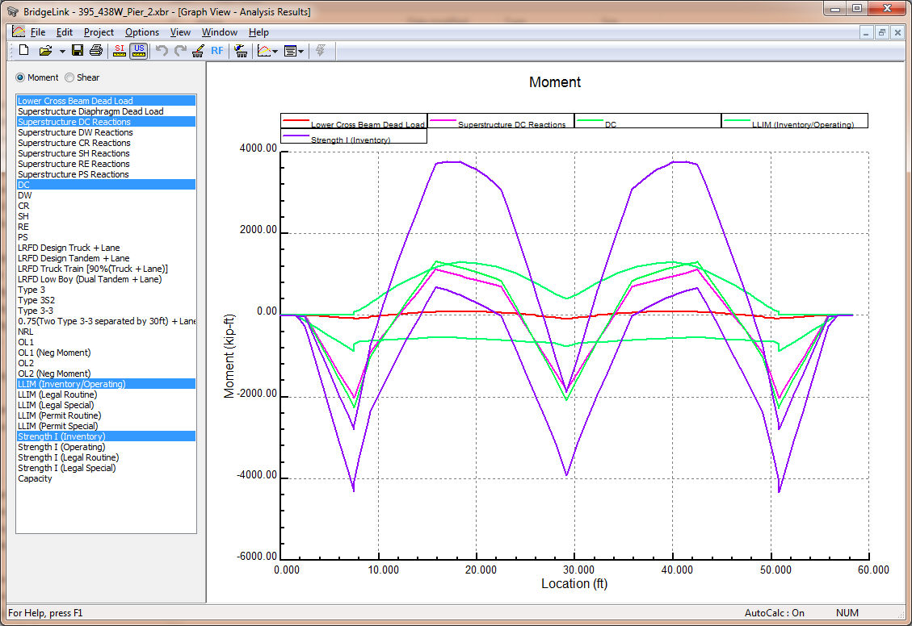

Analysis Results Graph {#chapter5_analysis_results_graph}
==============================================
The Analysis Results graph shows shear and moment diagrams for the various load cases analyzed.

The graph controller is located on the left side of the Graph View. Use the option buttons at the top to select Moment or Shear results.

Using your mouse, select one or more loads from the loading list. Hold the CTRL key when clicking the mouse to select several individual load cases. Hold the SHIFT key when clicking the mouse to select a consecutive sequence of loads.

**Exporting Graph Data**: Data from this graph can be exported to a file by clicking on the *Export Graph Data* button. See @ref ug_exporting_graph_data for more information.

> NOTE: The Strength II limit state results are not shown when the WSDOT BDM method is used for computing permit rating factors. In this case, graphing the Strength II limit state with the capacity does not give a representation of the rating factor.