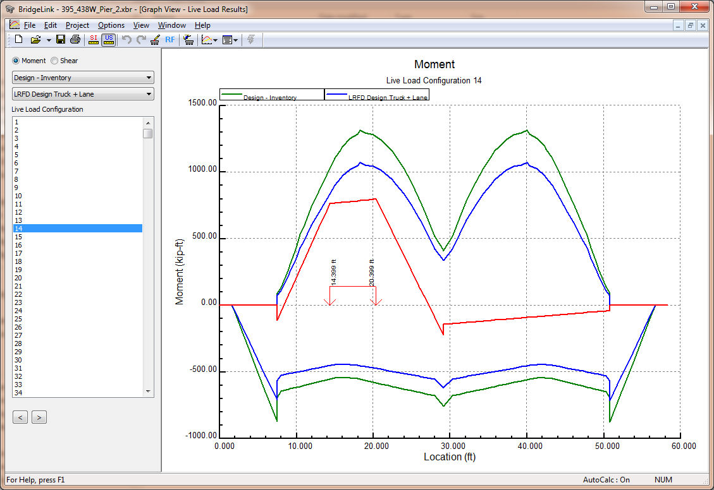
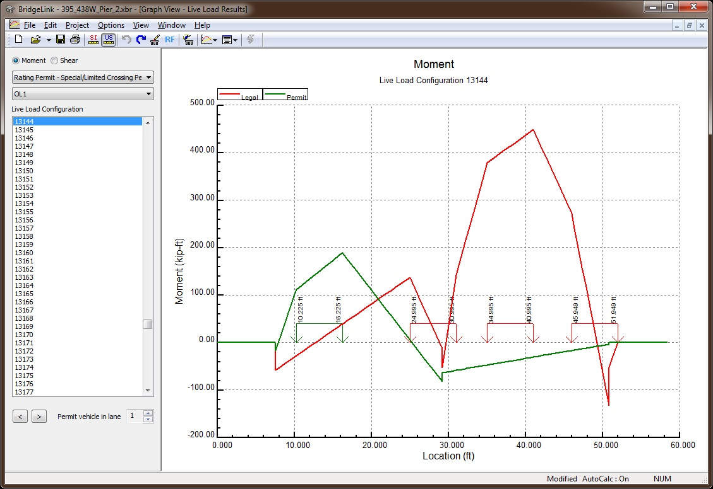

Live Load Results Graph {#chapter5_live_load_results_graph}
==============================================
The Live Load Results graph shows the shear and moment envelopes for the various live loads considered.

The graph controller is located on the left side of the Graph View. Use the option buttons at the top to select Moment or Shear results.

Use the first drop down list to select a rating type. Use the second drop down list to select a live load that is applied to the selected rating type.

The green graph represents the envelope of all the live load cases applied to the selected rating type. The blue graph represents the envelope for the select live load case.

Select a Live Load Configuration to see the results for a specific live load case. The diagram for the selected live load configuration is shown in red. The position of the wheel lines is also shown in the graphic.

Use the < and > buttons to step through the various live load configurations.

## Emergency Vehicle and Permit Live Load Configurations

When the emergency vehicle and permit rating factors are computed by the WSDOT BDM method the live load results shows only the results for the selected live load configuration. Each configuration consists of an emergency or permit vehicle response and the legal load response. The emergency/permit vehicle is shown in green and legal vehicle in red.

For the image above, you can see the permit vehicle is in one lane and the permit vehicles occupy remaining lanes. The results for the permit vehicle in the various lane positions can be viewed by selecting the permit vehicle lane position with the control at the bottom of the Live Load Configuration list.