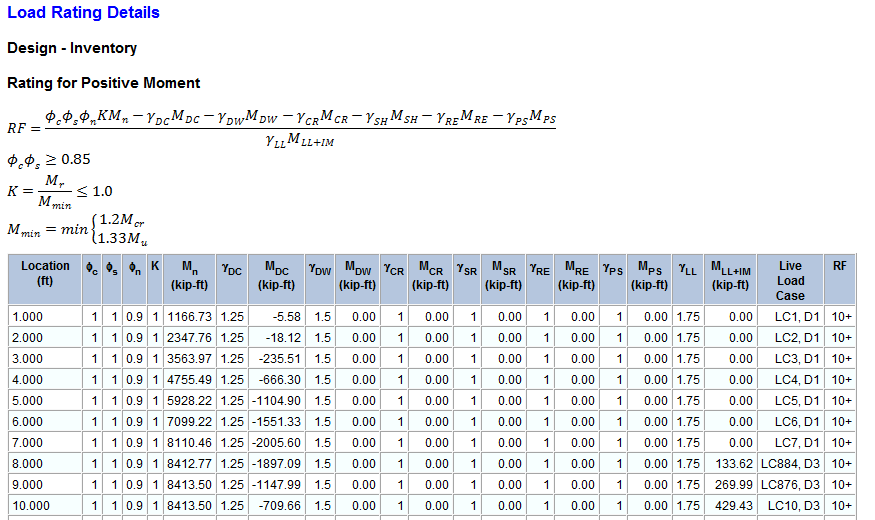

Load Rating Report {#chapter5_load_rating_report}
==============================================
The load rating report contains the results of the load rating analysis as well as all the supporting information including the detailed computation of rating factors and cross beam shear and moment capacity.

## Load Rating Chapter
The Load Rating Chapter lists the load ratings for the Design, Legal and Permit cases. For the design rating the rating factor for positive moment, negative moment, and shear, along with the live load factor and controlling point are reported for the Inventory and Operating cases.

The rating factor for each vehicle analyzed as well as the live load factor, controlling point, and cause of the minimum rating factor are reported for the legal and permit cases. If the rating factor for the legal case is less than one, a load posting analysis is automatically performed and the results list here.

## Load Rating Details Chapter
This chapter lists the details of the load rating analysis. The details include the rating factor equation and all the parameters used to compute the rating factor.

 
The live load case column lists the Live Load Configuration and the vehicle type that produce the controlling rating factor. The number following LC corresponds to the Live Load Configuration listed in the Live Load Results Graph discussed later in this chapter. For the design rating cases, the design live load governing, indicated by D and a number, are listed at the bottom of the table. The Live Load Case for permit load ratings, using the WSDOT BDM method, consist of a Live Load Configuration number and the lane where the permit vehicle is placed to cause the minimum rating factor. A Live Load Case of LC16543,P2 means the minimum rating factor occurred for live load configuration 16543 with the permit vehicle in lane 2.

Rating factors that are greater than 10 are listed as 10+.

The rows in the load rating details table consist of the rating factors evaluated at 1'-0" increments, the controlling location, and any location evaluated where the rating factor is less than 1.0.

## Pier Description Details Chapter
This chapter provides a complete listing of the pier description input.

## Loading Details Chapter
This chapter provides the load factors and the details of all input and generated loadings.

## Moment Capacity Details
This chapter provides the details that show how the moment capacity is computed.

## Shear Capacity Details
This chapter provides the details that show how the shear capacity is computed.

